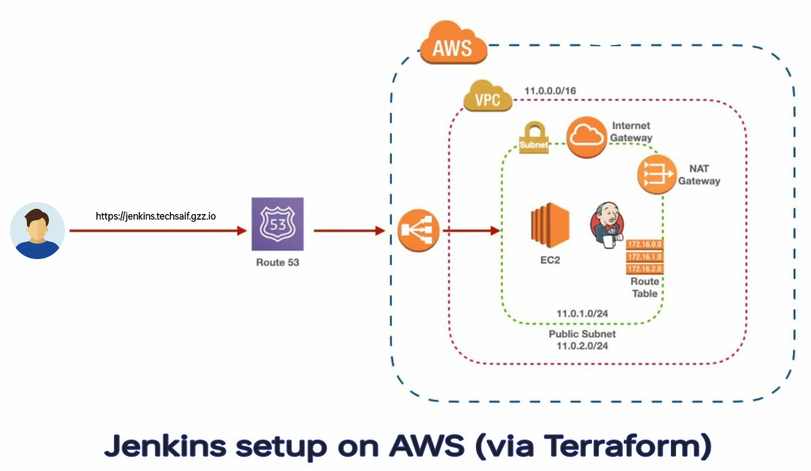
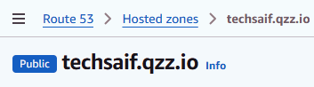
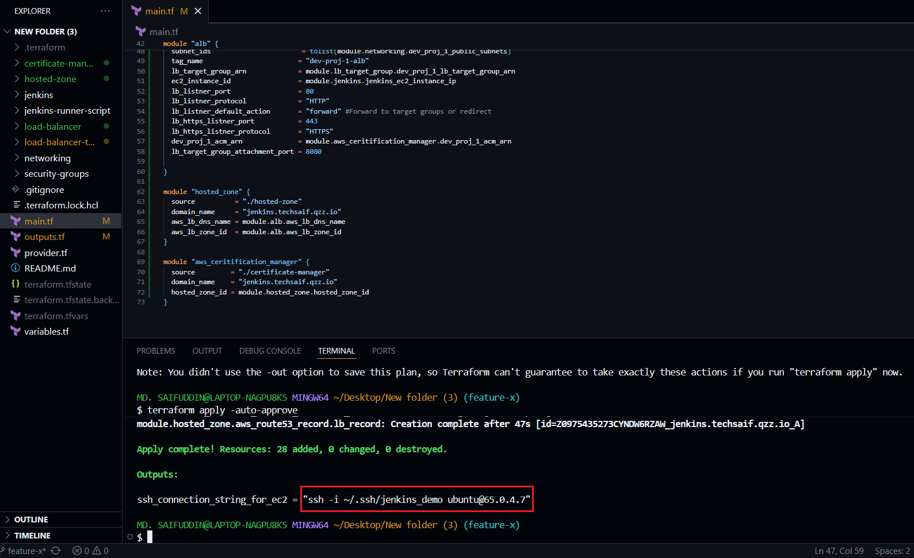
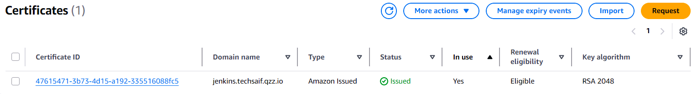

# Automated Jenkins Deployment on AWS using Terraform
*This project automates the Jenkins CI/CD environment on AWS — using Terraform as Infrastructure-as-Code (IaC). It provisions all networking, security, and application components, integrating with a custom domain and SSL certificate for secure web access.*

<p align="center">
  
</p>

## Project Overview
The setup automates the deployment of a Jenkins server behind an Application Load Balancer (ALB) with a valid SSL certificate (ACM), using Terraform Infrastructure as Code (IaC).

Main components:
➡️ Custom VPC with public subnets, Internet Gateway, and route tables
➡️ Security Groups for Jenkins and ALB
➡️ EC2 Instance for Jenkins (with User Data installation script)
➡️ Target Group and Application Load Balancer (ALB) setup
➡️ ACM Certificate for HTTPS
➡️ DNS Integration with Route 53

## Prerequisites
Before Running Terraform, Make sure you have the following prerequisites ready:
➡️ Terraform v1.3+ (recommended)
➡️ AWS CLI configured with proper IAM credentials
➡️ A registered domain name (e.g., from GoDaddy, Namecheap, etc.)
➡️ Hosted Zone created in Route 53 — Example: hosted zone name: techsaif.gzz.io
➡️ Name Servers updated at your domain registrar
➡️ Public and Private Key

## Step 1: 
### Setup Hosted Zone :
To work with this whole setup we need to setup  Route53 and in Route53 we first need to setup our hosted zone.

1️⃣  Navigate to Route 53 → Hosted zones → Create hosted zone
2️⃣  In the Domain name field, enter the exact domain name you own (e.g., techsaif.gzz.io)
3️⃣  Select Type → Public hosted zone
4️⃣  Click Create hosted zone

<p align="center">
  
</p>


## *How to Use*
#### 1. Clone the repo:
   ```bash
   git clone https://github.com/xrootms/terraform-jenkins-setup.git
   cd terraform-aws-vpc-ec2
   ```

#### 2. Copy and edit variables: (Update variable values as needed — VPC, CIDR, public key, region, etc.)
   ```bash
   cp terraform.tfvars.example terraform.tfvars
   ```

#### 3. Initialize Terraform:
   ```bash
   terraform init
   ```

#### 4. Plan and Apply:
   ```bash
   terraform plan
   terraform apply
   ```

#### 5. Get ssh connection for EC2:
<p align="center">
  
</p>

---
## *After successful deployment:*

### 🔹*Jenkins Installation (User Data)*

- During EC2 instance creation, a user data script automatically installs and configures Jenkins and Terraform.
Script used: jenkins-runner-script/jenkins-installer.sh

### 🔹*Domain Configuration:*

- The **ALB DNS** name is mapped to **jenkins.techsaif.gzz.io** using a Route 53 **A record**.

<p align="center">
  
</p>

### 🔹*SSL Configuration:*
- An **ACM** Certificate is created for: **jenkins.techsaif.gzz.io** and attached to the ALB for https traffic.

<p align="center">
  
</p>

  
### 🔹*Accessing Jenkins:*
- Once Terraform apply completes and DNS propagation finishes:
- Open **https://jenkins.techsaif.gzz.io** in your browser.
- 
<p align="center">
  
</p>

- Retrieve the initial Jenkins admin password from the EC2 instance:
<p align="center">
  
</p>

- Get the initial admin password:
  
  ```bash
  sudo cat /var/lib/jenkins/secrets/initialAdminPassword
  ```


---  
### *Notes*
- *ACM and ALB must be in the same AWS region.*
- *DNS propagation can take up to 30 minutes.*
- *Verify ACM validation status under AWS Console → Certificate Manager.*
- *To avoid incurring charges, destroy the infrastructure when no longer needed:*
```bash
terraform destroy    
```

  ⭐ If you found this project interesting, consider giving it a star!


