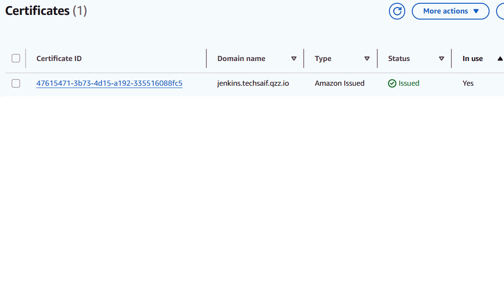
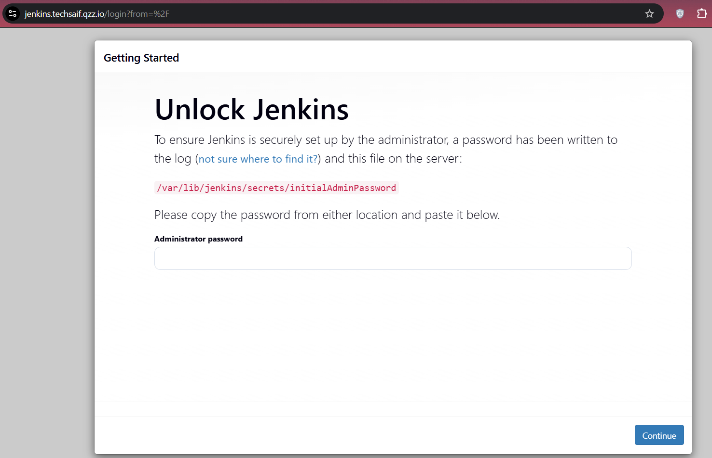
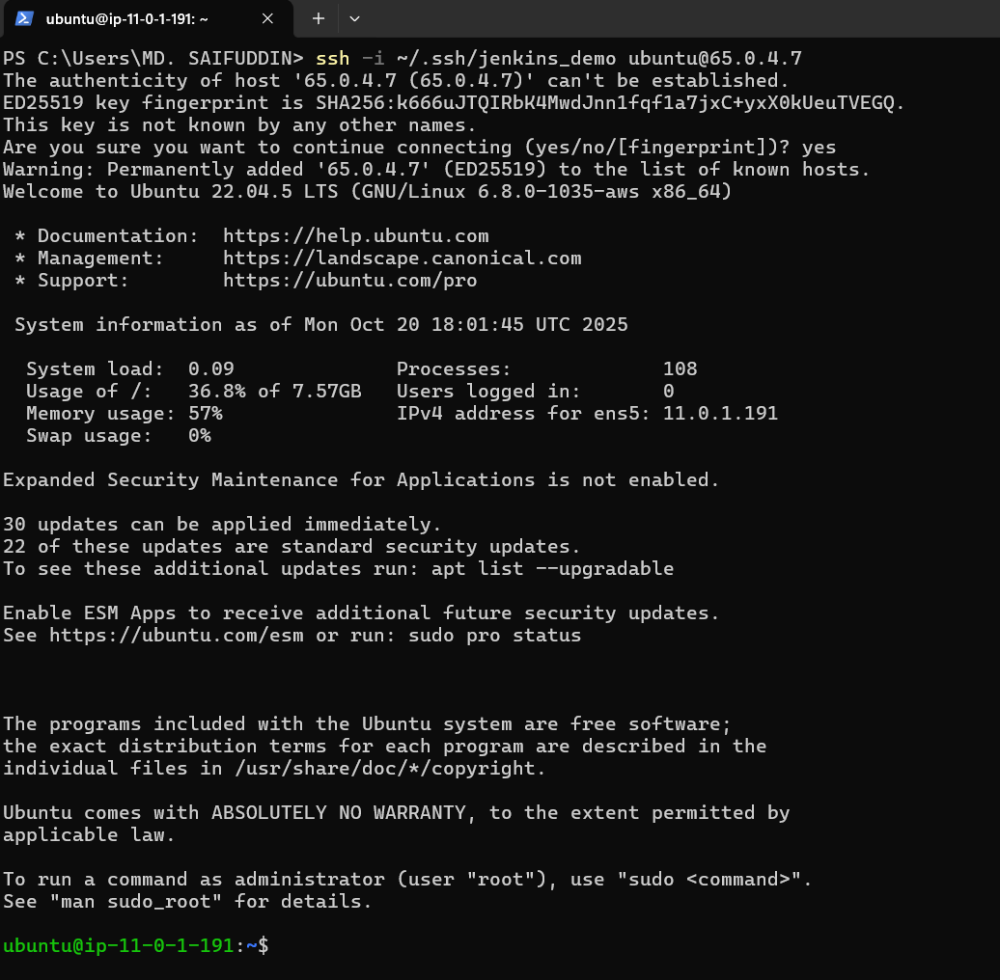

# Automated Jenkins Deployment on AWS using Terraform
This project automates the Jenkins CI/CD environment on AWS — using Terraform as Infrastructure-as-Code (IaC).
<p align="center">
  
</p>

## Prerequisites
### Before Running Terraform
Make sure you have the following prerequisites ready:

- **Terraform v1.3+** (recommended)  
- **AWS CLI** configured with proper IAM credentials  
- **A registered domain name** (e.g., from GoDaddy, Namecheap, etc.)  
- **Hosted Zone** created in Route 53  
  > Example: `hosted zone name: techsaif.gzz.io`
- **Name servers** updated at your domain registrar


## Infrastructure Components
#### This project provisions:
  
| Component                       | Directory                                    | Description                                                                      |
| ------------------------------- | -------------------------------------------- | -------------------------------------------------------------------------------- |
| **Networking**                  | `networking/main.tf`                         | Creates VPC, subnets, route tables, and Internet Gateway                         |
| **Security Groups**             | `security-groups/main.tf`                    | Defines inbound/outbound rules for Jenkins and ALB                               |
| **Load Balancer**               | `load-balancer/main.tf`                      | Creates ALB, target groups, and listeners                                        |
| **Target Group**                | `load-balancer-target-group/main.tf`         | Attaches EC2 instance to the target group                                        |
| **Certificate Manager**         | `certificate-manager/main.tf`                | Issues and validates ACM SSL certificate via DNS                                 |
| **Hosted Zone Records**         | `hosted-zone/main.tf`                        | Creates DNS records for domain and subdomain (e.g., jenkins.techsaif.gzz.io)     |
| **EC2 Instance (Jenkins)**      | `jenkins/main.tf`                            | Launches EC2 instance and runs Jenkins installer script                          |
| **Jenkins Setup Script**        | `jenkins-runner-script/jenkins-installer.sh` | Installs Jenkins and dependencies automatically on EC2 startup                   |


---
## 🛠️ How to Use

#### 1. Clone the repo:
   ```bash
   git clone https://github.com/xrootms/terraform-jenkins-setup.git
   cd terraform-aws-vpc-ec2
   ```

#### 2. Copy and edit variables: (Update variable values as needed — region, VPC CIDR, domain name, etc.)
   ```bash
   cp terraform.tfvars.example terraform.tfvars
   ```

#### 3. Initialize Terraform:
   ```bash
   terraform init
   ```

#### 4. Plan and Apply:
   ```bash
   terraform plan
   terraform apply
   ```

#### 5. Get EC2 Public IP:
   ```bash
   terraform output instance_public_ip
   ```
---
## After successful deployment:

#### Domain Configuration:

- The ALB DNS name is mapped to jenkins.techsaif.gzz.io using a Route 53 A record.
- DNS propagation may take up to 30 minutes after updating name servers.
  
To verify:
```bash
dig ns techsaif.gzz.io
dig jenkins.techsaif.gzz.io
```
#### SSL Configuration
An ACM Certificate is created for: jenkins.techsaif.gzz.io
- Validation is done automatically via Route 53 DNS records.
- The certificate is attached to the Application Load Balancer (ALB) for HTTPS traffic.
- 
</p>
- jj

---

#### Jenkins Installation (User Data)
**What it does:**
- Updates packages and installs OpenJDK 17 (required by Jenkins).
- Adds Jenkins’ official repository and installs Jenkins.
- Downloads and installs Terraform v1.13.3.
- Moves Terraform to /usr/local/bin for global access.
- Once EC2 launches, Jenkins runs automatically at:
http://<EC2-Public-IP>:8080 (later accessed via ALB domain)
  
#### Accessing Jenkins
Once Terraform apply completes and DNS propagation finishes:
- Open **https://jenkins.techsaif.gzz.io** in your browser.
- <p align="center">
  
</p>

- Retrieve the initial Jenkins admin password from the EC2 instance:
- <p align="center">
  
</p>
  
  ```bash
  sudo cat /var/lib/jenkins/secrets/initialAdminPassword
  ```
---
### Cleanup

```bash
terraform destroy    #To avoid incurring charges, destroy the infrastructure when no longer needed:
```

  
### Notes
- ACM and ALB must be in the same AWS region.
- DNS propagation can take up to 30 minutes.
- Verify ACM validation status under AWS Console → Certificate Manager.


### 👨‍💻 Author
**Saif Uddin**  
AWS Cloud Engineer | Terraform | Jenkins | DevOps  
📧 your-email@example.com  
🌐 https://techsaif.gzz.io
